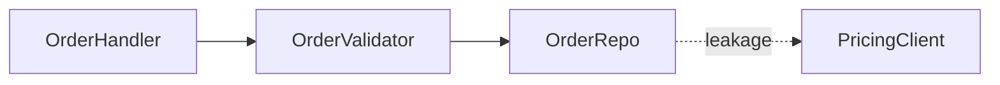
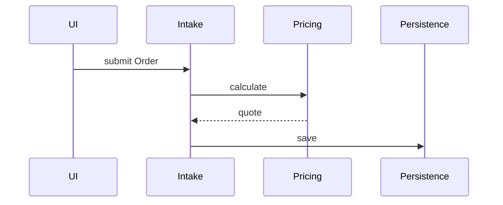
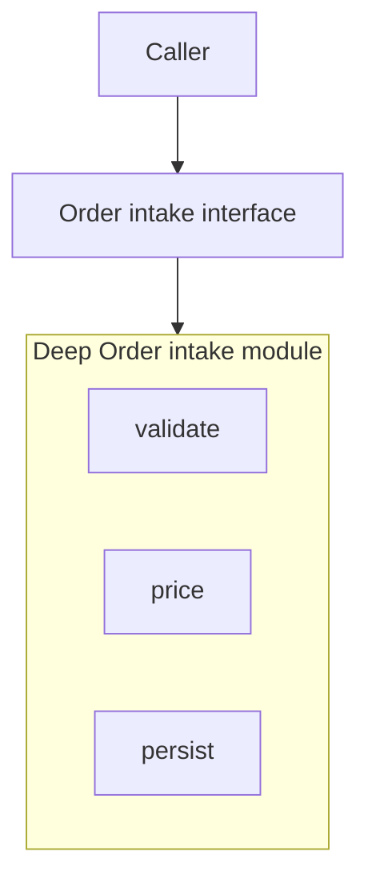

# Markdown Report Format

The architectural review is rendered as a single self-contained markdown file in the OS temp directory. It should be readable in plain text and richer in any markdown preview that supports Mermaid. Mermaid handles graph-shaped diagrams; concise markdown handles everything else. Do not use raw HTML, Tailwind, CSS, SVG, or external assets.

## Scaffold

````markdown
# Architecture review: {{repo name}}

_Generated: {{date}}_

Legend: `module` = box, `seam` = dashed arrow, `leakage` = red-labelled edge, `deep module` = one interface with absorbed implementation.

## Candidates

### 1. {{Candidate title}}

**Recommendation:** `Strong`  
**Dependency shape:** `ports & adapters`

**Files**

- `path/to/module.ts`
- `path/to/adapter.ts`

#### Before

```mermaid
flowchart LR
  A[Order intake module] --> B[Validation module]
  B --> C[Pricing module]
  C -. "leakage across seam" .-> D[Persistence adapter]
````

#### After

```mermaid
flowchart LR
  A[Order intake interface] --> B[Deep Order intake module]
  B --> C[Pricing adapter]
  B --> D[Persistence adapter]
```

**Problem:** Order intake is shallow; understanding one decision means chasing three modules.

**Solution:** Deepen Order intake so validation and pricing locality sit behind one interface.

**Wins**

- locality: one test surface
- leverage: one interface, many callers
- implementation absorbs shallow modules

**ADR callout:** contradicts ADR-0007, but worth reopening because pricing now leaks across the seam.

## Top recommendation

Start with **{{Candidate title}}** because {{one-sentence reason}}.
```

## Candidate Section

Each candidate is one `###` section:

- **Title** — short, names the deepening (e.g. "Collapse the Order intake pipeline").
- **Metadata** — recommendation strength (`Strong`, `Worth exploring`, `Speculative`) and dependency category (`in-process`, `local-substitutable`, `ports & adapters`, `mock`).
- **Files** — monospaced markdown list.
- **Before / After** — two subsections. Use Mermaid first; use a compact text diagram only when Mermaid would obscure the point.
- **Problem** — one sentence. What hurts.
- **Solution** — one sentence. What changes.
- **Wins** — bullets, <=6 words each. e.g. "Tests hit one interface", "Pricing logic stops leaking", "Delete 4 shallow modules".
- **ADR callout** (if applicable) — one sentence after the wins.

No paragraphs of explanation. If the diagram needs a paragraph to be understood, redraw the diagram.

## Diagram Patterns

Pick the pattern that fits the candidate. Mix them. Do not make every diagram look the same.

### Mermaid Graph

Use a Mermaid `flowchart` or `graph` when the point is "X calls Y calls Z, and look at the mess."



### Mermaid Sequence

Use `sequenceDiagram` when the friction is round trips, ordering, or orchestration spread across modules.



### Mermaid Subgraph Collapse

Before: several shallow modules. After: one deep module with internals inside a subgraph.



### Text Cross-Section

Use simple text when Mermaid would overfit layout. Keep it short.

```text
Before: caller -> thin validator -> thin mapper -> thin adapter -> repo
After:  caller -> deep intake module -> repo adapter
```

### Mass Diagram

Use a text mass diagram for "interface as wide as implementation."

```text
Before
interface:      ########
implementation: #########

After
interface:      ##
implementation: ############
```

## Presentation Guidance

- Keep each candidate scannable in one screenful where possible.
- Use headings, bold labels, bullets, and fenced diagrams for structure.
- Prefer Mermaid for visual shape; prefer plain markdown for editorial emphasis.
- Keep diagrams small enough to understand without horizontal scrolling.
- Avoid raw HTML and external assets. Markdown should remain portable.
- Use code spans for files, modules, interfaces, adapters, and recommendation badges.

## Top Recommendation

End with one short section. Candidate name plus one sentence on why. Do not re-argue every card.

## Tone

Plain English, concise — but the architectural nouns and verbs come straight from the `/codebase-design` skill. Concision is not an excuse to drift.

**Use exactly:** module, interface, implementation, depth, deep, shallow, seam, adapter, leverage, locality.

**Never substitute:** component, service, unit (for module) · API, signature (for interface) · boundary (for seam) · layer, wrapper (for module, when you mean module).

**Phrasings that fit the style:**

- "Order intake module is shallow — interface nearly matches the implementation."
- "Pricing leaks across the seam."
- "Deepen: one interface, one place to test."
- "Two adapters justify the seam: HTTP in prod, in-memory in tests."

**Wins bullets** name the gain in glossary terms: _"locality: bugs concentrate in one module"_, _"leverage: one interface, N call sites"_, _"interface shrinks; implementation absorbs the wrappers"_. Do not write _"easier to maintain"_ or _"cleaner code"_ — those terms are not in the glossary and do not earn their place.

No hedging, no throat-clearing, no "it's worth noting that...". If a sentence could be a bullet, make it a bullet. If a bullet could be cut, cut it. If a term is not in the `/codebase-design` glossary, reach for one that is before inventing a new one.
